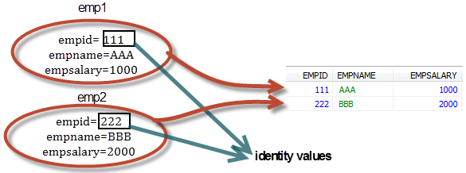

# 🔐 JPA Identifier Property: 식별자 필드 설계와 동기화 전략

> “엔티티의 식별자를 어떻게 정의하느냐가 곧 JPA의 동기화 전략과 객체 생명주기를 좌우한다.”

JPA(Entity 클래스)에서 **식별자 필드(Identifier Property)** 는 단순한 `@Id` 이상입니다.
이 필드는 객체의 **영속적 정체성(persistent identity)** 을 결정하며, 내부적으로 DB와의 **동기화 시점과 타겟**을 결정하는 핵심 기준이 됩니다.

---

## 📌 1. Identifier Property란?

JPA에서 모든 Entity 클래스는 **반드시 하나 이상의 식별자 필드(identifier field)** 를 선언해야 합니다.
이 필드는 객체가 **DB 테이블에서 어떤 행(row)을 대표하는지 결정**하는 기준입니다.

```java
@Entity
public class Product {

    @Id
    private Long id;

    private String name;
}
```

* `@Id` 어노테이션을 통해 식별자 지정
* 해당 필드는 DB 테이블의 **기본 키(primary key)** 와 매핑되는 것이 일반적이지만, JPA 차원에서는 **DB에 PK 제약 조건이 없어도 반드시 필요**

---

## 🧬 2. 식별자의 역할

### ✅ 객체 ↔ DB 간 정체성 유지

* 식별자 값은 객체의 “영속적 ID”
* JPA는 식별자 값으로 두 객체가 같은 DB row를 나타내는지 판단
<br>
  

### ✅ JPA 동기화 기준

* Java 객체가 수정되면, JPA는 `UPDATE ... WHERE id=?` 형태로 쿼리를 생성
* DB에서 데이터가 바뀌었는지 감지할 때도 `SELECT ... WHERE id=?` 기반으로 조회

> **동기화 기준은 항상 식별자 필드입니다.**

---

## 🔍 3. 식별자 선언 방식

| 방식            | 설명                                               |
| ------------- | ------------------------------------------------ |
| **어노테이션 기반**  | `@Id`, `@EmbeddedId`, `@IdClass`                 |
| **XML 매핑 기반** | `orm.xml`에 `<id>...</id>` 또는 `<composite-id>` 정의 |

대부분의 현대 프로젝트에서는 **어노테이션 기반 방식이 선호**됩니다.

---

## 🧭 4. 단일 vs 복합 식별자

### ✅ 단일 식별자(Singular Identity Field)

```java
@Entity
public class Customer {
    @Id
    private Long customerId;
}
```

* 하나의 컬럼만으로 고유 식별 가능
* DB의 **UNIQUE 또는 PRIMARY KEY** 컬럼과 매핑됨

---

### ✅ 복합 식별자(Composite Identity Field)

```java
@Embeddable
public class OrderId implements Serializable {
    private Long orderId;
    private Long productId;
}

@Entity
public class Order {
    @EmbeddedId
    private OrderId id;

    private int quantity;
}
```

* **두 개 이상의 필드**로 식별자 구성
* 복합 키를 사용한 DB 테이블과 매핑하거나, 고유 식별 기준이 여러 개일 때 사용
* 반드시 `Serializable` 구현 필요

---

## 🛠️ 5. 복합 식별자 구성 방식

| 전략            | 어노테이션                 | 설명                                         |
| ------------- | --------------------- | ------------------------------------------ |
| `@EmbeddedId` | `@Embeddable` + 필드 객체 | 객체형 키 구조, 복합 필드 클래스를 그대로 사용                |
| `@IdClass`    | 별도 식별자 클래스를 키로 사용     | Entity 클래스에 각 필드에 `@Id` 선언, 식별자 클래스는 별도 존재 |

### 비교

| 항목       | `@EmbeddedId` | `@IdClass` |
| -------- | ------------- | ---------- |
| 재사용성     | 높음 (별도 객체)    | 낮음         |
| 직관성      | 우수 (객체 중심)    | 명시적        |
| 필드 선언 위치 | 식별자 객체 필드     | 엔티티 내 필드   |

---

## 🧩 6. 식별자 변경 시 동작

### 변경 시 동기화 원칙

* **객체 → DB**:
  식별자 기반으로 기존 row를 찾아 `UPDATE` 수행

* **DB → 객체**:
  식별자 기반으로 다시 `SELECT` 수행하여 객체 필드 값 갱신

* **식별자 값 변경**:
  JPA는 **동일 객체가 아님을 판단** → 경우에 따라 **새로운 영속 객체 생성**

### ⚠️ 주의

* 식별자 필드는 변경되지 않도록 설계하는 것이 이상적입니다 (`final`, `immutable` 방식 권장)
* 식별자 값이 바뀌면 **1차 캐시(Persistence Context)** 에서도 새 객체로 인식됨

---

## 🧪 7. 실무 설계 기준

| 상황                   | 식별자 구성 방법                          |
| -------------------- | ---------------------------------- |
| DB 테이블에 **기본 키** 있음  | 해당 컬럼을 단일 식별자로 사용                  |
| DB 테이블에 **복합 키** 있음  | `@EmbeddedId` 또는 `@IdClass` 사용     |
| DB 테이블에 **제약 조건 없음** | 개발자가 판단하여 고유 조건을 추론하여 복합 식별자 구성 필요 |

> **DB 스키마가 정규화되지 않은 경우**에도 JPA는 Entity 설계가 반드시 정해져야 하므로, 이 판단은 개발자의 몫입니다.

---

## 📌 마무리 요약

| 개념                                 | 설명                             |
| ---------------------------------- | ------------------------------ |
| **식별자 필드란?**                       | 객체의 영속 ID, DB에서 고유한 행을 식별하는 필드 |
| **@Id vs @EmbeddedId vs @IdClass** | 단일 식별자 vs 복합 식별자 (객체 or 클래스)   |
| **식별자 변경의 위험**                     | 동기화 혼란, 1차 캐시에서 새 객체로 인식됨      |
| **DB 제약과 독립성**                     | JPA는 DB PK 유무와 무관하게 식별자 필수 요구  |

